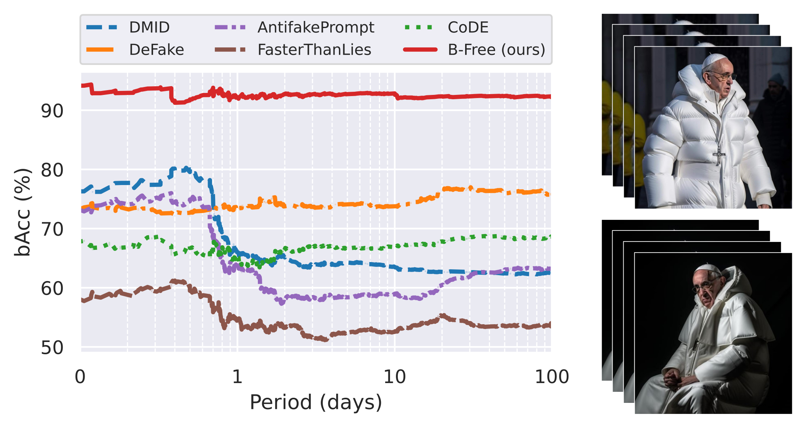

## Dataset of viral images

The dataset comprises real and fake images that went viral on internet and includes multiple web-scraped versions of
each image, for a total of about 1400 images.

## Download
The links to the images are in `BFree_viral_images.csv`, which now includes 1111 images (as some links were not available anymore).
The csv contains:
- **filename**: the image will be saved with this filename
- **label**: REAL or FAKE
- **source_id**: ID of the source image, all images with the same ID are different instances of the same image
- **date**: date of the online post
- **days_since_1st_post**: relative date, days elapsed from the oldest instance of each source_id
- **w, h**: size of the image
- **md5**: md5 of the image
- **url**: url of the image

You can download the dataset using the `download.ipynb` script.

## Visualization
First, save your results in a csv with the column `filename` and a column for each detector.
The detectors columns should contain the logit scores (in the range [-inf,inf]).
If the predictions are probabilities (range [0,1]), change the threshold accordingly for a correct computation of the metrics.

Csv example:

| filename                          | B-Free    | DMID      |
|-----------------------------------|-----------|-----------|
| REAL/Ed7JvuVXsAUTp-j/img00400.jpg | -4.431049 | -9.541626 |
| FAKE/FsL1ChiXwAAaVFk/img03517.jpg | 5.462078  | 0.092956  |
| ...                               | ...       | ...       |

To visualize the graph as in the figure below, run the notebook `time_graph.ipynb`.

## Results

  

The figure shows the performance in terms of balanced accuracy evaluated over a 100-day period from
the time of initial online post (Log scale). \
The performance drops after only one day, after which most competitors are stuck below 70%. Only B-Free is
able to ensure an average accuracy around 92% even after many days from the first on-line post.

